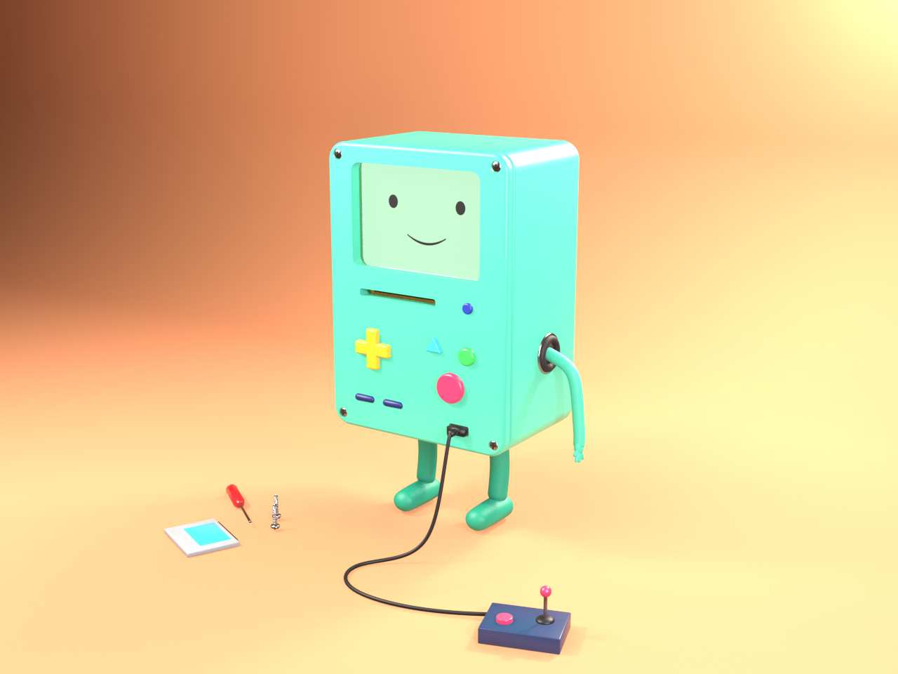
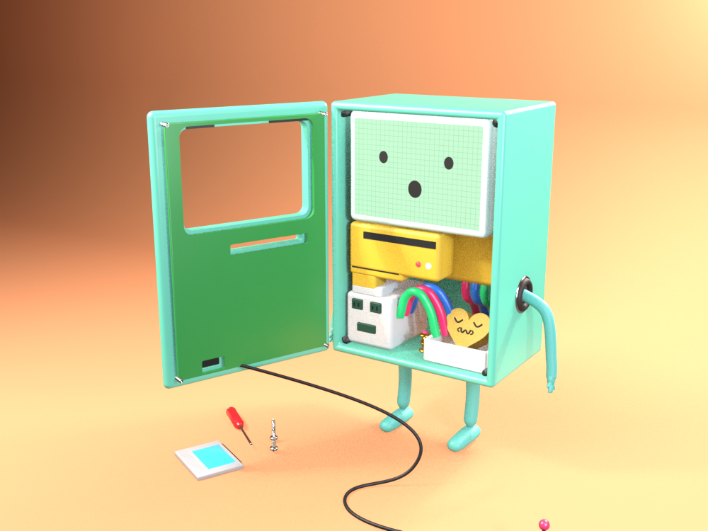
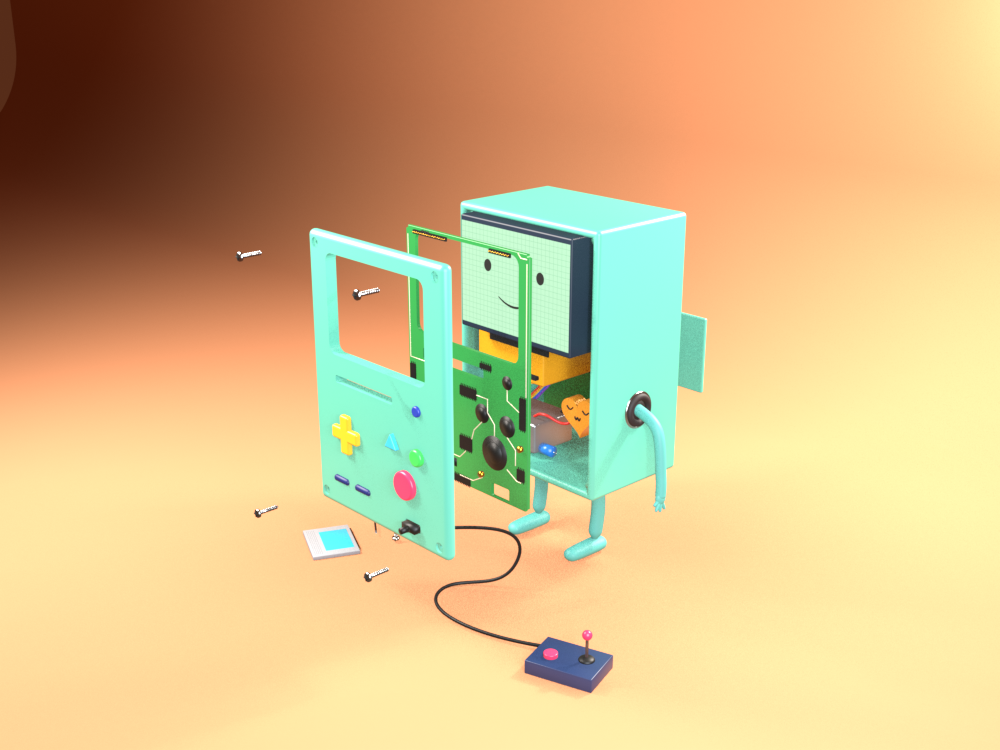
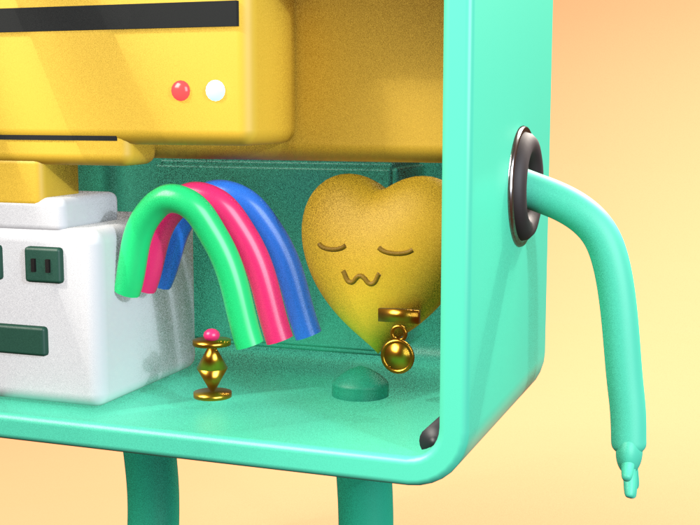
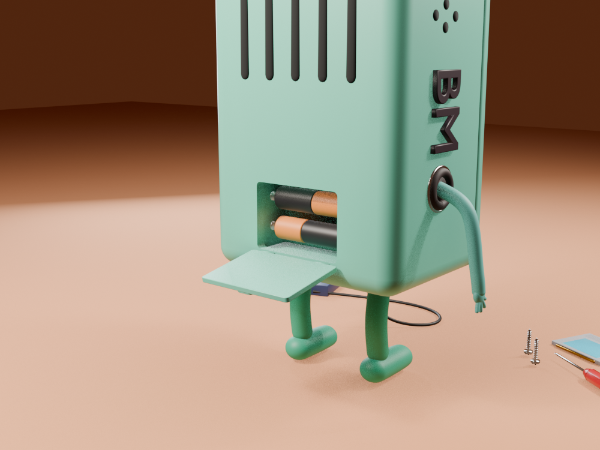
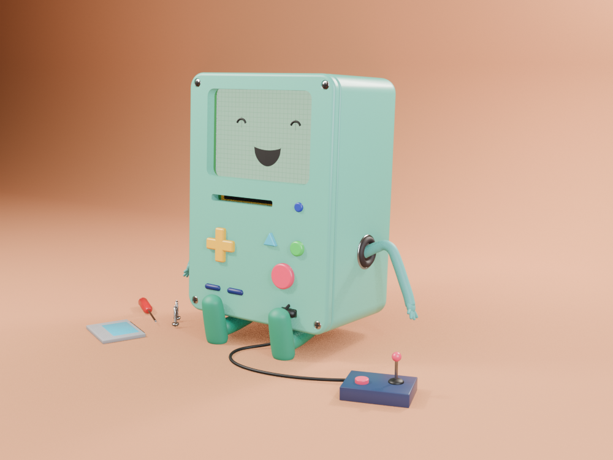
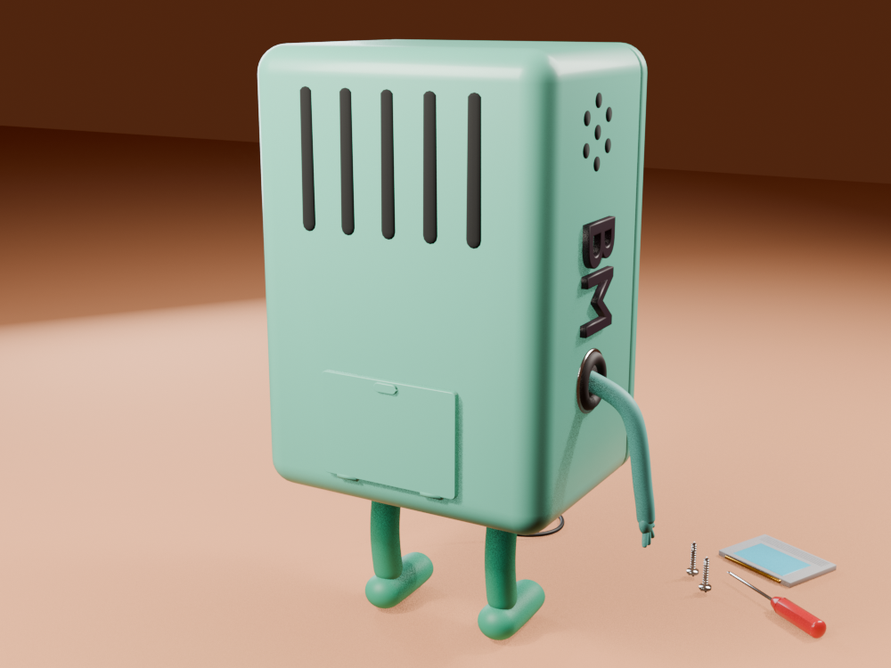

# BMO: interactive 3D fan project

**Live site → https://medtahiri.github.io/BMO/**

A fully procedural, rigged and animated **BMO** from *Adventure Time*, generated in Blender with Python and presented on an interactive React + three.js website. You can open BMO up, explode it, play games on its screen with its own buttons, and watch clips on BMO TV.

Built with [Claude Code](https://claude.com/claude-code) by **Mohamed Tahiri**.



| | | |
|---|---|---|
|  |  |  |
|  |  |  |

---

## Website features

The site is a scroll story in 10 sections. BMO is one persistent 3D character that the camera stages differently in each section.

| Section | What BMO does |
|---|---|
| **Who's BMO?** | Idles and follows your mouse with its eyes. Click BMO and it waves. |
| **Meet BMO** | Turntable and talking, with a short character bio. |
| **Face & feelings** | 7 expressions. BMO's real buttons react: D-pad looks, red laughs, green blinks, triangle gasps. |
| **Under the faceplate** | Your scroll opens the faceplate, then explodes BMO into its parts. Hotspots explain each component. |
| **Batteries included** | BMO turns around and the hinged battery door drops open to show 2 AA cells. |
| **BMO Arcade** | 3 playable games rendered on BMO's LCD, controlled with BMO's own buttons. |
| **BMO TV** | Official Cartoon Network clips play inside BMO's screen, or load your own video. BMO's buttons are the remote. |
| **Moves gallery** | All 10 animations: Idle, Wave, Walk, Talk, Open up, Batteries, Explode, Play game, Sit, Sad. |
| **Fun facts & episodes** | BMO sits like the toy figure. |
| **Who made this** | About the author, with BMO waving from the side. |

There's also a **Free play** drawer with every animation, expression and a slider for every control, plus a **sound toggle** in the top-right corner.

### BMO Arcade

The games are named after games BMO plays in the show. Only the titles (and the Guardians of Sunshine bosses) come from the show; the gameplay is my own interpretation.

- **Guardians of Sunshine**: a platformer where you beat Bouncy Bee, Hunny Bunny and Sleepy Sam. Attack mid-jump for a COMBO.
- **Lumpy Space Invaders**: lumpy invaders march down, and the waves speed up.
- **Bug Battle**: squash bugs popping out of nine holes. Gold bugs are worth 50.

| BMO button | Keyboard | In games | On BMO TV |
|---|---|---|---|
| D-pad | Arrows / WASD | move, choose | ◀ ▶ seek 10s · ▲ ▼ volume |
| Red | Z / Space | jump, fire, squash, start | play / pause |
| Green | X | sword, fire | mute |
| Triangle | C | (unused) | next channel |
| Dashes | Enter | pause | next channel |
| Blue dot | Esc | back to menu / exit | TV off / on |

### Sound

- **Sound effects** (buttons, doors, explosions, game blips) are synthesized live with the Web Audio API, so there are no audio files.
- **BMO's voice lines** are AI text-to-speech generated on [fish.audio](https://fish.audio). No audio from the show is used.
- Any sound can be replaced by listing a file in `web/public/sounds/sounds.json`. See `web/public/sounds/README.md` for the names.

### Performance

- three.js loads in a lazy chunk, so first paint needs about 75 KB of gzipped JS.
- The model is a lossless meshopt GLB: 761 KB, about 320 KB gzipped.
- Lighting is a procedural studio environment (PMREM), with no HDR download.
- A blob shadow replaces shadow maps.
- Raycasting is limited to clickable parts, and static parts skip matrix updates.
- Adaptive pixel ratio uses `PerformanceMonitor`, and `prefers-reduced-motion` is honored.

---

## The Blender model

Everything is generated by `bmo_build.py` (Blender 5.1). There are no hand-made assets.

- **Shell**: hollow teal case with rounded corners, screw posts, speaker grille, raised **BM** letters (the arm socket forms the "O"), rear vents, and a battery bay with 2 AA cells and a hinged door.
- **Faceplate**: hinged on the left edge, with screen window, cartridge slot, controller port, all the buttons and 4 threaded screws.
- **PCB**: behind the faceplate, with contact pads, chips, pin headers and traces.
- **Screen**: emissive LCD. The face is real geometry, and the mouth has shape keys (Smile, Open, Frown, Surprise).
- **Internals**: screen block, stepped cartridge drive with LEDs, power block, rainbow tubes, hourglass, and BMO's puffy **heart** with a sleepy face and medal (it beats).
- **Limbs**: skinned noodle arms with fingers, and chunky legs with round feet and leg IK.
- **Accessories and stage**: controller with a cable hooked to the front port, cartridges, screwdriver, spare screws, backdrop, lights and camera.

### Animating in Blender

Select **BMO_Rig**. Everything is keyframable from **Object → Custom Properties**:

| Property | Effect |
|---|---|
| `lid_open` 0–1 | faceplate swings open on its hinge |
| `explode` 0–1 | exploded view (plate, PCB, spinning screws, screen) |
| `back_open` 0–1 | battery door swings down |
| `face_smile` / `face_open` / `face_frown` / `face_surprise` | mouth expressions (mixable) |
| `blink`, `eye_look_x`, `eye_look_z`, `eyes_happy` | eyes (`eyes_happy` = ^ ^) |
| `screen_on` 0–3 | LCD brightness |
| `cartridge_insert` 0–1 | slides a cartridge into the slot |

The **bones** are `root`, `body`, FK arms (`arm_upper/arm_lower/hand.L/R`) and leg IK (`foot_ik.L/R`, `knee_pole.L/R`).

The **actions** are `BMO_Idle`, `BMO_Wave`, `BMO_Walk`, `BMO_Talk`, `BMO_OpenLid`, `BMO_BatteryDoor`, `BMO_Explode`, `BMO_PlayGame`, `BMO_Sit` and `BMO_Sad`, plus `BMO_Showreel`, which plays all of them in a row.

The drivers only use simple expressions, so they work without enabling "Auto Run Python Scripts".

---

## Project structure

```
bmo_build.py          Blender script that generates the whole model, rig and animations
bmo.blend             generated Blender file
export_web.py         exports web/public/models/bmo.glb + clips.json
render_previews.py    renders preview stills to renders/
render_videos.py      renders each animation clip (used by make_videos.sh)
make_videos.sh        renders + encodes MP4s into videos/ (not committed)
blender.sh            runs the Flatpak Blender with a fixed color config
renders/              preview images
web/                  React + three.js website
  src/three/          3D scene: model, drivers, camera, LCD shader
  src/games/          BMO Arcade (console + 3 games)
  src/sections/       story sections, BMO TV, footer, free play
  src/audio/          Web Audio sound effects
  src/content/bmo.ts  all the site text, author info and credits
  scripts/            model export, voice generation/import
.github/workflows/    deploy to GitHub Pages
```

## Running it

```bash
# website
cd web
npm install
npm run dev          # http://localhost:5173
npm run build        # production build → web/dist
npm run preview      # serve the build at /BMO/ like GitHub Pages
npm run model        # re-export the model from bmo.blend after changing it

# Blender (from the repo root)
./blender.sh -b --factory-startup --python bmo_build.py -- --out bmo.blend   # rebuild the model
./blender.sh -b bmo.blend --python render_previews.py -- renders            # preview stills
./make_videos.sh                                                            # MP4 per animation
./blender.sh bmo.blend                                                      # open in the GUI
```

**Deploying**: every push to `main` builds `web/` and publishes it to GitHub Pages through `.github/workflows/deploy.yml`.

**Flatpak Blender note**: the Flatpak (5.1.1) ships an OCIO 2.5 config with an OCIO 2.4 library, so color management is broken out of the box. `blender.sh` creates a patched copy in `.ocio/` on first run and points Blender at it, which makes Standard, AgX and Filmic work again.

---

## Credits & copyright

- *Adventure Time*, BMO and all related characters and elements are trademarks of and © **Cartoon Network**. This is a **non-commercial fan project**. It is not affiliated with, sponsored or endorsed by Cartoon Network or Warner Bros. Discovery.
- *Adventure Time* was created by Pendleton Ward. BMO is voiced by Niki Yang in the original series.
- The video clips in BMO TV are official Cartoon Network uploads, embedded from YouTube.
- The 3D model, rig, animations, games and website are original fan work by **Mohamed Tahiri**, made with Claude Code.
- The sound effects are original synthesized audio. The BMO voice lines are AI text-to-speech generated on fish.audio. No audio from the show is used.

If you're a rights holder and want something removed, open an issue or contact me on GitHub.

## Author

**Mohamed Tahiri**, Software Engineer
[GitHub](https://github.com/MedTahiri) · [LinkedIn](https://www.linkedin.com/in/mohamed-tahiri-112239222/)
